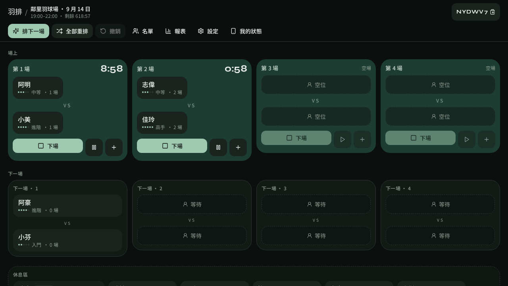

# 羽排 YUPAI

當日現場 **單打排點看板**。團主用平板橫向改棋盤，球友手機只看自己的狀態。

不做訂場、報名、繳費或會員系統——只解決「現在誰上場、下一場誰打、休息區怎麼排」這一件事。

[完整架設說明](docs/SETUP.md) · [配對邏輯](#自動配對) · [技術架構](#技術架構)



---

## 這是什麼

羽球團現場最常卡在白板、群組訊息和口頭排隊。羽排把一場當日活動變成一個 **場次碼**：

| 角色 | 裝置 | 能做什麼 |
|---|---|---|
| **團主 / 主控** | 平板橫向（建議） | 拖名牌、自動填場、結束本場、改設定、匯出名冊 |
| **球友** | 手機直向 | 輸入場次碼 → 選自己的暱稱 → 只讀狀態頁 |
| **旁觀** | 任何瀏覽器 | 輸入場次碼進看板，沒有主控密鑰就是只讀 |

場次碼長得像 `A3K7MQ`（6 碼，避開容易混淆的 `0 / O / 1 / I`）。主控密鑰存在建立場次那台裝置的 `localStorage`，不需要帳號。

---

## 功能

### 現場看板

- 1–6 面場，單打固定兩人一面
- 每面場有 **場上正數計時**（可暫停、可延長）與 **上場順位**（不綁場地）；記分下場後順位 1 先補該空場，休息區只進順位
- 休息區、未到、強制休息、離場
- 拖放名牌：休息區 ↔ 場上 ↔ 上場順位；可指定替換某個座位
- 1.5 秒輪詢，多台裝置看同一塊棋盤

### 自動配對

「補順位」只把休息區排進上場順位；「空場上場」再依順位 1 開始補空場。場上的人不動。

配對分數依四個權重（可切換預設）：

| 預設 | 等待 | 上場次數 | 避免重逢 | 程度接近 |
|---|---|---|---|---|
| **公平優先** | 4 | 4 | 3 | 1 |
| **強度優先** | 2 | 1 | 2 | 5 |

硬限制：

- 連續打滿 N 場必須休息（預設 2）
- 下場後強制休息 1 輪（可關）
- 黑名單兩人永不配在一起
- 指定配對（preferred）優先消耗
- 可選「禁止剛打完的對手再配一次」
- 連續三次同一對手會被大幅降權；硬限制擋死時才放寬

### 名單與報表

- 手動加球員、程度 **1–18 級**（初學 / 入門 / 中下 / 中等 / 中上 / 高手）
- CSV 匯入：`暱稱,程度,臨打`（程度填 1–18）
- 下場預設跳出比分：兩人得分或只點勝者
- 依比分動態調整程度（Elo 式，一場大約半級以內），配對下一場會用新程度
- 本機記住常打的人（不含臨打），下次開場可快速帶入
- 報表：上場次數、總打分鐘、等待、輪空、對手、程度升降
- 匯出 CSV（球員 + 已完成場次與比分）

### 主控權

- 建立場次的裝置拿到 `hostToken`，才能改棋盤
- 樂觀鎖（`version` CAS）：兩台同時寫入時後到的會被退回並提示
- 單步撤銷
- 6 碼移交碼，5 分鐘內可把主控交給另一台裝置；連續錯 5 次即作廢，接下後主控密鑰會換新

---

## 畫面與路由

| 路徑 | 用途 |
|---|---|
| `/` | 開場、加入場次、示範看板 |
| `/s/:code` | 團主看板 |
| `/s/:code/me` | 球友個人狀態（只讀） |
| `/s/:code/report` | 當日報表與 CSV 匯出 |

---

## 快速開始

### Windows 一鍵（現場筆電）

1. 下載倉庫 ZIP：[ken0618102000/dune-topaz-crystal-marble](https://github.com/ken0618102000/dune-topaz-crystal-marble) → Code → Download ZIP，解壓縮。
2. 雙擊 **`一鍵啟動.bat`**。沒裝 Node 會自動裝，瀏覽器會自己打開看板。
3. 手機 / 平板連同一 Wi-Fi，用視窗裡印的區網網址進入。場次存在 `data\`，關掉再開還在。

詳細（防火牆、代裝失敗）見 [docs/SETUP.md](docs/SETUP.md#windows-一鍵啟動)。

### 本機開發

不必設定資料庫。沒有 `DATABASE_URL` 時用內嵌 PGLite。開發模式重啟後記憶體資料會清空；Windows 一鍵啟動會把資料寫進 `data\`。

```bash
git clone https://github.com/ken0618102000/dune-topaz-crystal-marble.git
cd dune-topaz-crystal-marble
npm install
npm run dev
```

瀏覽器開 [http://localhost:8080](http://localhost:8080)。

正式上線（Vercel + Neon Postgres）請走 **[docs/SETUP.md](docs/SETUP.md)**。

常用指令：

```bash
npm run dev          # 開發伺服器，0.0.0.0:8080
npm run build        # 正式建置；有 DATABASE_URL 時一併跑 migration
npm run typecheck    # TypeScript
npm test             # 含配對演算法測試
```

---

## 現場怎麼用

1. 團主在首頁填場館、日期、時間、面數、每場時長，按 **開場**。
2. 把場次碼念給球友，或把 `/s/XXXXXX/me` 連到群組。
3. 名單裡把人標成「已到 / 休息」；或一次 **全部簽到**。
4. 按 **補順位** 把人排進上場順位，再按 **空場上場** 讓順位 1 補目前空著的場。
5. 一場打完按結束；若開了「下場後強制休息」，剛下來的人會進強制休息一輪。
6. 收工看報表，需要就匯出 CSV。

想先看成品：首頁按 **開啟示範看板**（4 面場、13 人）。

CSV 範例：

```csv
暱稱,程度,臨打
阿凱,14,
小美,10,
臨打王,6,是
```

程度：`1`–`18`（`1–3` 初學 · `4–6` 入門 · `7–9` 中下 · `10–12` 中等 · `13–15` 中上 · `16–18` 高手）。舊檔若填 1–5 會自動對應。第三欄 `是` / `臨打` / `1` / `true` 都會標成臨打。

---

## 技術架構

```
瀏覽器（React 19）
  ├── 團主看板  ──mutate──►  TanStack Start server functions
  ├── 球友狀態  ──poll──►              │
  └── localStorage（deviceId / hostToken）
                                       ▼
                              persist.server.ts
                                       │
                    ┌──────────────────┴──────────────────┐
                    ▼                                     ▼
            Neon Postgres                         PGLite（本機 / 預覽）
            DATABASE_URL 有值時                    沒設時自動 fallback
```

核心程式都在 `src/lib/yupai/`：

| 檔案 | 職責 |
|---|---|
| `engine.ts` | 純函式狀態機：所有棋盤動作 |
| `matching.ts` | 配對打分、黑名單、指定配對 |
| `persist.server.ts` | Postgres 讀寫、CAS、撤銷、移交 |
| `api.ts` | `createServerFn` 入口 |
| `csv.ts` | 名單 / 報表 CSV |
| `ids.ts` | 場次碼、主控密鑰、移交 PIN |

資料表（`migrations/0002_yupai.sql`）：`yupai_sessions`、`yupai_players`、`yupai_restrictions`、`yupai_matches`、`yupai_ops`。

沒有登入系統。權限靠場次碼 + `host_token` + 裝置 id。列是「無主」的——知道場次碼的人都能讀，持有密鑰的人才能寫。

---

## 技術棧

- **Node.js 22**、npm
- **React 19** + **TanStack Start / Router / Query**
- **Vite 8** + **Nitro**（Vercel preset）
- **Tailwind CSS v4**
- **Postgres**（Neon 或 PGLite）+ **Kysely / pg**
- **Zod** 驗證 server function 輸入

---

## 專案結構

```text
src/
  components/board/     團主看板、場卡、名冊、設定
  components/landing/   首頁開場 / 加入
  components/player/    球友個人頁
  components/report/    報表
  hooks/                useBoard（1.5s 輪詢 + 樂觀鎖）
  lib/yupai/            引擎、配對、持久化
  routes/               檔案路由
migrations/
  0002_yupai.sql        羽排 schema
  auth/                 Better Auth（本專案未啟用，不會套用）
docs/SETUP.md           詳細架設
```

`.grok/`、`AGENTS.md`、`public/__grok/`、`scripts/grok-pwa-*` 是 Grok App Builder 平台檔，本機自架可以忽略，但不要刪——正式建置的 PWA / OG 會用到一部分。

---

## 授權

私人儲存庫。未經授權請勿公開再散佈。
